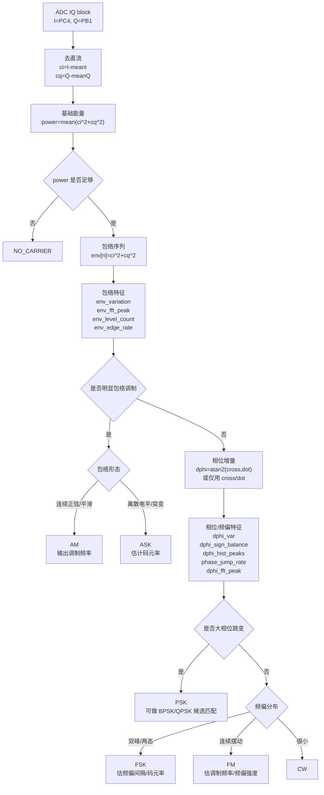

# 调制识别判别方案（2026-05-05）

本文档用于给后续代码实现者说明当前推荐的调制识别方案。目标平台为 STM32H743，输入为锁定载波后的 IQ 基带数据。

## 1. 当前工程背景

- 工程路径：`D:\VSCodeCMAKEProject\Simple_wireless_IQ_demodulation`
- 当前 ADC 映射：
  - `adc1_buf`：I 路，PC4 / ADC1_INP4
  - `adc2_buf`：Q 路，PB1 / ADC2_INP5
- 当前调制识别入口：
  - `Core/App/Signal/app_mod_detect.c`
  - `app_mod_detect_process_iq_block(const uint16_t *i_buf, const uint16_t *q_buf, uint32_t sample_cnt)`
- 当前任务链：
  - 先由 `app_signal_detect_process_block()` 完成扫频和锁定。
  - 只有 `stage == APP_SIGDET_STAGE_VPP_LOCKED && locked != 0 && carrier_present != 0` 时才调用调制识别。

## 2. 当前代码的判别顺序

当前分类函数在 `app_mod_detect.c` 的 `app_moddet_classify()` 中。

现有顺序：

1. `carrier_present == 0` -> `NO_CARRIER`
2. `psk_jump_pm` 高，且 `env_variation_pm` 低 -> `PSK`
3. 正负频率方向都出现，且 `freq_activity` 高 -> `FSK`
4. `env_variation_pm` 高，且 `freq_activity` 不太高 -> `AM`
5. `freq_activity` 高 -> `FM`
6. 否则 -> `CW`

这个顺序的问题是相位类优先，AM/ASK 这类包络调制可能被相位噪声或突变误吸收。建议后续改成包络类优先。

## 3. 推荐的新判别顺序

推荐总原则：先判断有没有信号，再判断是否包络调制，最后再进入相位/频率调制分支。

推荐顺序：

1. `NO_CARRIER`
2. 包络类：`AM / ASK`
3. 相位跳变类：`PSK`
4. 频率两态类：`FSK`
5. 连续频率调制类：`FM`
6. 稳定载波：`CW`

理由：

- AM/ASK 的主要特征是包络变化，应该优先判断。
- PSK/FSK/FM 的主要特征在相位增量或瞬时频率上。
- FFT 可作为辅助特征，但不建议用“是否有频谱峰”直接决定类别。

## 4. 基础信号定义

输入 ADC 原始样本：

```c
I_raw[n] = i_buf[n]
Q_raw[n] = q_buf[n]
```

先去直流：

```c
mean_i = mean(I_raw)
mean_q = mean(Q_raw)

ci[n] = I_raw[n] - mean_i
cq[n] = Q_raw[n] - mean_q
```

复数基带：

```c
z[n] = ci[n] + j * cq[n]
```

瞬时功率/包络功率：

```c
mag2[n] = ci[n] * ci[n] + cq[n] * cq[n]
```

平均功率：

```c
power = mean(mag2[n])
```

## 5. dphi 的含义与实现

相邻 IQ 点的相位增量：

```c
dphi[n] = angle(z[n] * conj(z[n-1]))
```

展开为：

```c
dot   = ci[n] * ci[n-1] + cq[n] * cq[n-1]
cross = cq[n] * ci[n-1] - ci[n] * cq[n-1]

dphi = atan2(cross, dot)
```

说明：

- `dphi` 是相邻两个采样点之间的相位变化，不是绝对相位。
- 因为只看相邻点相位差，所以通常不需要对整段相位序列做解缠绕。
- 前提是相邻采样点之间真实相位变化小于 `pi`，也就是频差没有超过采样率一半。
- 如果不想算 `atan2`，可以先用 `cross`、`dot` 的符号和幅度做近似特征。

注意：

- 当前代码里的 `cross` 定义与上面推荐定义可能符号相反。用于活跃度问题不大，用于频偏方向时必须统一符号。

## 6. 建议计算的特征量

### 6.1 载波存在

```c
ac_power = mean(mag2[n])
carrier_present = (ac_power >= APP_MODDET_MIN_AC_POWER)
```

输出：

- 无信号：`NO_CARRIER`
- 有信号：进入后续识别

### 6.2 包络调制特征

包络变化强度：

```c
env_variation_pm = mean(abs(mag2[n] - mean_power)) / mean_power * 1000
```

包络频谱辅助：

```c
env_ac[n] = mag2[n] - mean_power
env_fft = FFT(env_ac)
env_fft_peak_freq = peak_frequency(env_fft)
env_fft_peak_ratio = peak_power / total_power
```

包络电平离散性：

```c
env_level_count
env_edge_rate
env_flatness
```

用途：

- `env_variation_pm` 高：优先进入 AM/ASK 分支。
- 包络平滑、近似连续：倾向 AM。
- 包络离散电平、突变明显：倾向 ASK。
- `env_fft_peak_freq` 可用于估计 AM 调制频率或 ASK 码元率。

### 6.3 相位/频率调制特征

相邻相位增量：

```c
dphi[n] = atan2(cross, dot)
```

可替代近似量：

```c
freq_activity = mean(abs(cross)) / mean_power * 1000
positive_freq_percent = count(cross > 0) / pair_count * 100
negative_freq_percent = count(cross < 0) / pair_count * 100
phase_jump_rate = count(dot < 0) / pair_count * 1000
```

瞬时频率序列：

```c
inst_freq[n] = dphi[n] * Fs / (2 * pi)
```

相位/频率频谱辅助：

```c
dphi_ac[n] = dphi[n] - mean(dphi)
dphi_fft = FFT(dphi_ac)
dphi_fft_peak_freq = peak_frequency(dphi_fft)
dphi_fft_peak_ratio = peak_power / total_power
```

用途：

- `phase_jump_rate` 高：倾向 PSK。
- `dphi` 或 `cross` 的直方图呈双峰：倾向 FSK。
- `dphi` 连续变化且频谱有明显低频成分：倾向 FM。
- `dphi_fft_peak_freq` 可用于估计 FM 调制频率或 FSK 码元率。

## 7. PSK 的最大似然问题

PSK 可以用最大似然方法求，但不建议第一版实现完整 ML。

完整 ML 通常需要：

- 符号定时恢复
- 载波相位估计
- 星座阶数假设
- 码元率估计
- 噪声方差估计

当前工程更建议使用简化版星座匹配：

```c
u[n] = z[n] / abs(z[n])
```

候选特征：

```c
bpsk_score = abs(mean(u[n]^2))
qpsk_score = abs(mean(u[n]^4))
```

解释：

- BPSK 经过平方后相位会更集中。
- QPSK 经过四次方后相位会更集中。
- 分数越高，说明越符合对应 PSK 阶数。

第一版可以只判断是否 PSK，不细分 BPSK/QPSK。后续再根据 `bpsk_score`、`qpsk_score` 区分阶数。

## 8. FFT 的使用原则

FFT 可以做，但应作为辅助特征。

建议使用：

- 包络 FFT：辅助 AM/ASK，估计调制频率或码元率。
- `dphi` FFT：辅助 FM/FSK，估计调制频率或码元率。

不建议：

- 不要直接用“有无频谱峰”作为最终类别判定。
- 不要直接对绝对相位 `phi[n]` 做 FFT，除非已经完成可靠解缠绕。

原因：

- AM 单音调制时包络 FFT 有峰，但语音或复杂信号未必是单峰。
- FSK/PSK 随机码元频谱可能较宽，不一定有窄峰。
- 绝对相位存在 `2*pi` 跳变，直接 FFT 容易误判。

## 9. STM32H743 上的 CORDIC 说明

当前项目使用 STM32H743。该系列通常不要按有 CORDIC 外设来设计。

建议：

- 不依赖 CubeMX 的 CORDIC 外设。
- 优先使用现有 `cross/dot` 近似特征。
- 需要 FFT 时使用 CMSIS-DSP。
- 需要 `atan2` 时先做低频率、降采样或块级计算，不要每个 ADC 点都直接调用高开销浮点 `atan2f`。

可选优化：

- 用查表或快速近似 `atan2`。
- 只在锁定后、降采样后的 IQ 上计算 `dphi`。
- 第一版先用直方图和符号统计，不强制计算真实角度。

## 10. 推荐流程图



## 11. 建议第一版代码落地范围

第一版不要一次性实现完整 FFT 和最大似然。

建议先做：

1. 重排分类顺序：`NO_CARRIER -> AM/ASK -> PSK -> FSK -> FM -> CW`
2. 保留现有 `env_variation_pm`、`freq_activity`、`psk_jump_pm`
3. 新增包络离散性特征，用于后续区分 AM/ASK
4. 新增 `dphi/cross` 直方图特征，用于后续区分 FSK/FM
5. FFT 作为二期辅助功能，先不进入主判据

## 12. 需要保留的调试输出

建议串口输出字段：

```text
mod2,mode=AM,ac=...,env=...,env_peak=...,env_levels=...,freq=...,jump=...,hist=...,conf=...
```

建议至少输出：

- `mode`
- `ac_power`
- `env_variation_pm`
- `env_fft_peak_freq`
- `env_level_count`
- `freq_activity`
- `phase_jump_rate`
- `dphi_hist_peak_count`
- `confidence`

## 13. 当前日志给出的经验阈值

基于 2026-05-02 的 CW/AM 日志：

- CW 样本：`env_variation_pm` 大多低于 `260`，少量尖峰到 `426`
- AM 样本：`env_variation_pm` 约 `549 ~ 606`

记录建议：

- 通用 AM 阈值候选：`350`
- 当前 10kHz、50% AM 工况候选：`450`
- `freq_activity` 暂不建议先动

注意：

- 30MHz AM 缺独立日志，需要补测。
- 阈值最终应基于 30/40/50MHz 的 CW、AM、ASK、FM、FSK、PSK 全部样本重新定版。
